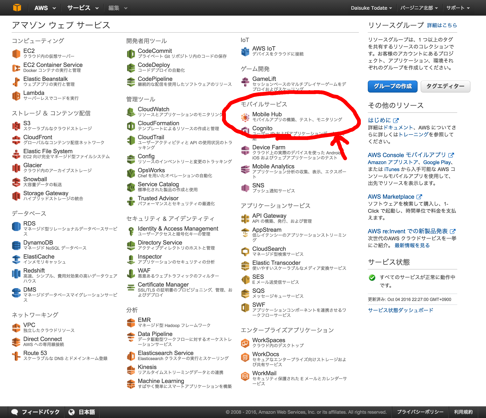
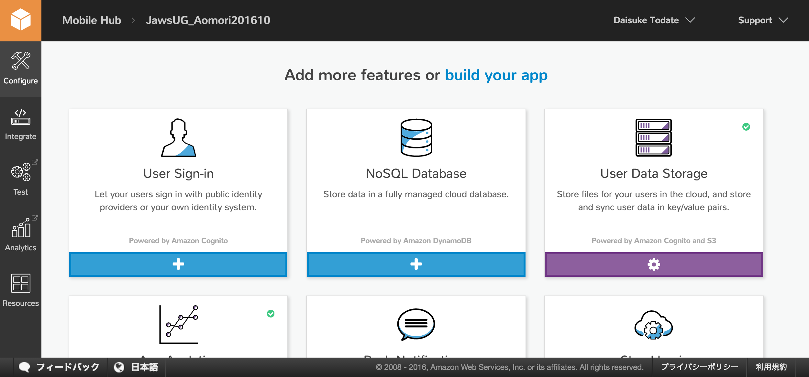
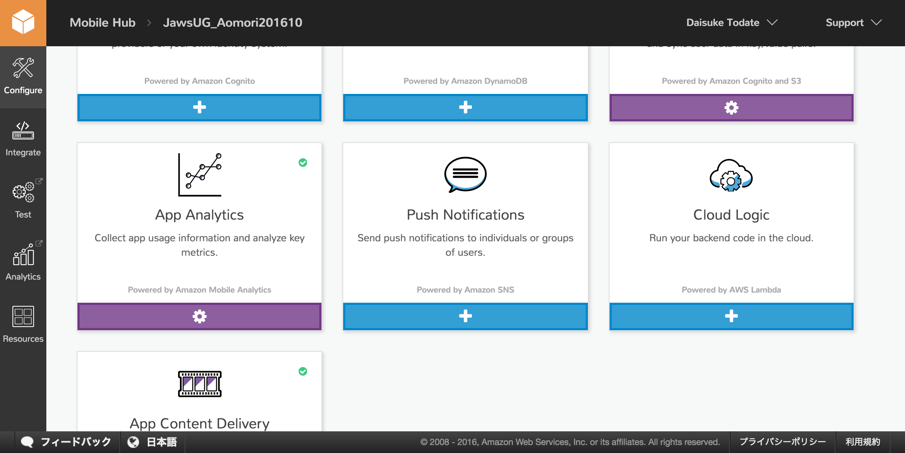
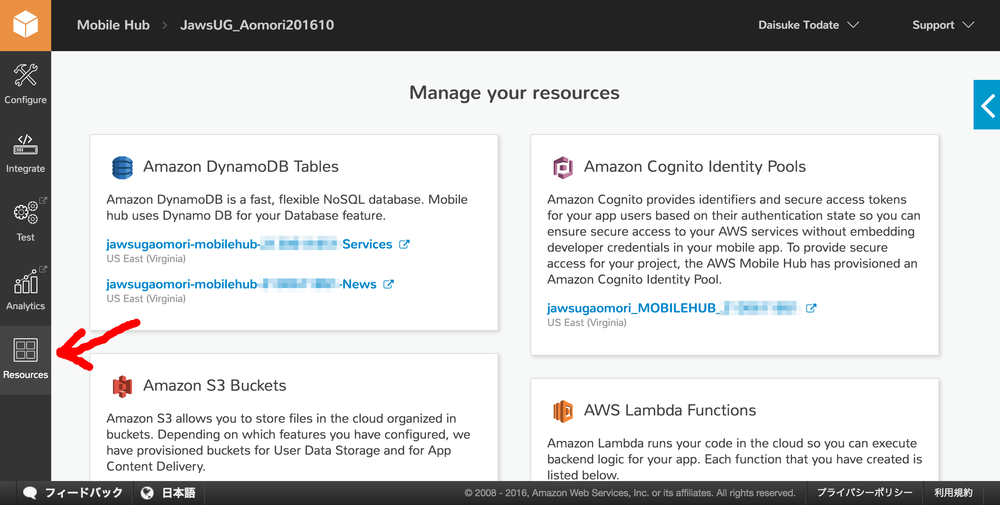
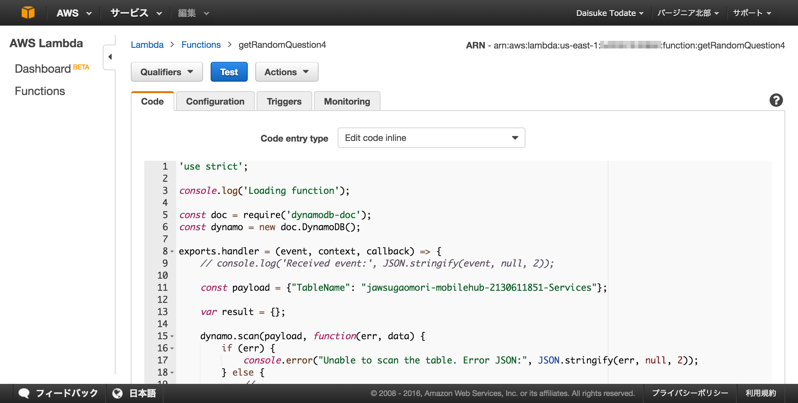

# [JAWS-UG青森]ハンズオン勉強会
モバイルアプリ編 - AWS Mobile Hub -

2016/10/28（金）18:30 - 20:30

---

# 今回のハンズオンは...

## 流れ
1. AWS Mobile Hubの説明
2. サンプルアプリをダウンロード＆動作確認（←ここまで必須
3. 簡単なクイズアプリを作ってみる（←任意

## 注意

- Windows環境での開発サポートは、時間がかかるかもしれないので、あらかじめご了承ください...

---

# AWS Mobile Hubの説明

---

# コンソール画面を見てみましょう

---

# ログイン
- アカウント持ってる人は自分のアカウントでログインしてください
- 持ってない人は、運営側で用意したユーザーを使用してログインしてください（別紙参照）

---

# サービス一覧画面を見てみましょう

---



---

## こんな画面になります
※プロジェクトが既にある場合です


---

## [Create new mobile project]をクリック
適当な名前で構いません


---

## プロジェクトができました
設定をしていきましょう


---

# その前に...

---

# ７つの機能をさらっと説明
1. User Sign-in
2. User Data Storage
3. App Analytics
4. Push Notifications
5. Cloud Logic
6. App Content Delivery
7. NoSQL Database **(New!)**

---

# User Sign-in
## ユーザー認証
###### Powered by Amazon Cognito

### 特徴
- 独自のユーザーIDシステムまたは、Facebookのような人気のソーシャルログインを介してなど、ユーザーがアプリケーションにどのようにサインインするか設定できる

---

# User Data Storage
## データストレージ
###### Powered by Amazon Cognito and S3

### 特徴
- ユーザープロファイルや好み、ハイスコアまたはゲームの状態などのキーと値のペアのユーザーデータをユーザーの認証済みデバイス間でデータを同期させることができる
- Amazon S3 のバケットとフォルダを生成し、それぞれにファイルの適切な読み書き権限を設定できる

---

# App Analytics
## アクセス解析
###### Powered by Amazon Mobile Analytics

### 特徴
- DAU/MAUや新規ユーザー数、セッション数、イベントの発生状況などの情報を取得して可視化できる
- 60分以内に反映される（リアルタイムではない）
- Google Analyticsのスクリーントラッキング機能にあたるものが見当たらない...

---

# Push Notifications
## プッシュ通知
###### Powered by Amazon SNS

### 特徴
- Apple (APNS and APNS Sandbox) および Google (GCM) のプッシュ通知サービスを通してプッシュ通知を設定できる

---

# Cloud Logic
###### Powered by AWS Lambda


### 特徴
- AWS Lambdaをアプリから直接呼び出せる

---

# App Content Delivery
## コンテンツ配信
###### Powered by Amazon S3 and CloudFront

### 特徴
- リソースファイルまたはオーディオビデオファイルなどのアプリケーション資産のクラウドストレージを設定できる
- AWSコンテンツ配信ネットワーク(CDN)を通してグローバルにキャッシュし、公開することもできる

---

### どこから取得するかを決められる
|設定|取得元|
|---|---|
|**Single location**|S3からの直接ダウンロード
|**Global CDN**|CloudFrontからのファイル配信

### 注意
- ファイルの実体はS3に (project name)-contentdelivery-mobilehub-********** のような名前のバケットが作られ、そこに保存される
- public状態で保存される（アクセス制御が必要なら注意）

---

# NoSQL Database
###### Powered by Amazon DynamoDB

### 特徴
- アプリケーションで使用するデータを保存およびクエリできる、Amazon DynamoDB を追加できる

---

## 実は最近追加されたばかり (4/22)


###### https://aws.amazon.com/jp/about-aws/whats-new/2016/04/aws-mobile-hub-adds-nosql-database-service/

---

# SampleAppで使い方を確認

---

# 今回は...
User Sign-in, Push Notifications は時間の都合上、割愛させていただきます。

ご了承ください。

---

## コンソール上で作業していきます

### まずは[App Analytics]から


---

### [Add Analytics] ->  [Save Changes] -> [Configure more feautures]をクリック


---

### 色が変わったら設定完了です


---

### 次は[User Data Storage]


---

### [Store user data] -> [Save Changes] -> [Configure more feautures]をクリック


---

### 色が変わったら設定完了です



---

### 次は[App Content Delivery]


---

### [Single location] -> [Save Changes] -> [Configure more feautures]をクリック


※S3からの取得をする設定

---

### 色が変わったら設定完了です


---

### 次は[Cloud Logic]



---

### [Enable logic] をクリック


---

## Lambdaに関数を作成

[Enable Logic]をクリック後、[Create a new function...]をクリック


---

## blueprintで[hello-world]を選択

[hello]でフィルターをかけるとすぐ見つかります。


---

## そのまま[next]を選択


---

## 関数を作成していく

### Name
「hello-world-xxxxxx」にしてください
（xxxxxxは周りと被らないように設定）※名前を推奨
### Runtime
「Node.js 4.3」のまま
### Lambda function code
Lambdaで実行するコードを記入します。今回は変更しません

---

(続き)

### Handler
「index.handler」のまま変更しない
### Role
「Create new role from template(s)」を選択
### Role name
「hello-world-role-xxxxxx」に変更
（xxxxxxは周りと被らないように設定）※名前を推奨

---

### Policy templates
Lambdaから呼び出しをするAWSサービスの権限を設定します。今回は「Simple Microservice permissions」を選択

### 終わったら...
 [Next] -> [Create]を押して関数を作成します

---

### 作った関数をテストしてみる

[Test]を押して、実行結果に「"value1"」が表示されるか確認してください。


---

### MobileHubのページへ戻り、「Function name」の横の更新ボタンをクリックします。自分で作成したLambda functionにチェック -> [Save Changes] -> [Configure more feautures]をクリック


---

### 色が変わったら設定完了です


---

### 最後に[NoSQL Database]


---

### [Enable NoSQL]をクリック


---

### [Add a new table]をクリック


---

### 今回は[Example]をクリック


---

### [News]をクリック


---

### [News]をクリック


---

### [Create table]をクリック
テーブル名、権限、属性、インデックスなどの情報を編集できますが、今回はそのままで。


---

### [Create table]をクリック


---

### [Configure more feautures]をクリック


---
### 色が変わったら設定完了です


---

### 画面上部の[integrate with my app]をクリック
横メニューの[Integrate]でもOK


---

### [Android]タブをクリック
iOSはSwiftとObjective-Cが選べます


---

### [Download a sample app]をクリックして、ファイルをダウンロード
だいたい1MBくらい？
一緒に解凍も行ってください。


---

# Android Studioでビルドしてみよう

---

### [Android Studio]を起動
2016年11月28日の最新Verは2.2.2です


---

### [Open an existing Android Studio Project]をクリック


---

### 解凍したフォルダ内の[MySampleApp]を選択して、[OK]をクリック


---

### アップデートが必要っぽい


---

### 起動できたかな？


---

# エミュレータもしくは実機で確認

---

### ツールバーの[右三角]をクリック


---

### ターゲットを選択
実機の場合は、[Connected Devices]から選択
エミュレータの場合は、[Available Virtual Devices]から選択
※エミュレータの起動には時間がかかります


---

### アプリが起動しました


---

# サンプルアプリを動かしてみる

---

## あれ？[User Sign-in]がある...？


設定しなくても[匿名ユーザー]を管理できます


---

## 作ったリソースってどこから確認できる？

画面左側メニューの[Resources]から、各サービスへのリンクがあります。



---

## 関数の中を見てみる

Lambdaのエディタ画面で見てみましょう。


---

## サンプルソースとの対応表
各画面のソースを見て、具体的な処理方法を確認しましょう。

|機能|ファイル名|
|---|---|
|(User Sign-in)|IdentityDemoFragment|
|User Data Storage|UserFilesBrowserFragment<br>UserSettingsDemoFragment|
|App Analytics|AppAnalyticsDemoFragment|
|Cloud Logic|CloudLogicDemoFragment|
|App Content Delivery|ContentDeliveryDemoFragment|
|NoSQL Database|NoSQLSelectOperationDemoFragment|

---

# 実際にアプリを作ってみよう

---

## ...の前に

### 注意
- エミュレータで確認している方
  - **エミュレータを絶対に消さないでください**。(再起動させるのにも少し時間がかかります)
- AWSアカウントを使用されている方
  - SampleAppを作った際にできたリソースは、Mobile Hubのプロジェクトを消してもAWS上に残ります。気になる方は個別に削除してください。


---

## クイズアプリのプロジェクト一式を準備する
今回はこちら側で作ったものを使用します。

### 使用するファイル
今回の資料 `QuizApp` フォルダに入っています。

### (作業）
1. プロジェクトをAndroid Studioで開く
1. エミュレータもしくは実機で動作確認

---

## SDKの作成

---

## (1)新しいMobile Hubプロジェクトを作成

SampleAppを作った時と同様に作業をしていきます。

プロジェクト名は適当な名前で構いません。


---

## (2)使うサービスを有効にしていく

|機能|ファイル名|
|---|---|
|User Data Storage|[Store user data]にして保存|
|App Analytics|[Add Analytics]にして保存|
|App Content Delivery|[Single location]にして保存|
|Cloud Logic|(後述)|
|NoSQL Database|(後述)|

---

## (1-1)[S3]問題用アイコン画像をアップロード

[Resources]メニューから、[Amazon S3 Buckets]の[(PROJECTNAME)-contentdelivery-mobilehub-xxxxxxxxxx]を選択


---

## (1-1)[S3]問題用アイコン画像をアップロード

ファイルを選択してアップロードしてください。

※最低4件は登録してください。
(使用)`QuizApp-material/icons/require/`下の4ファイル

---

## (1-1)[DynamoDB]問題用テーブル作成

- テーブル名：「Services」
- パーミッション：protected

|Attribute name|Type|Partition key|Sort key|
|---|---|---|---|
|userId|String|On|-|
|serviceId|String|-|On|
|caption|String|-|-|
|category|String|-|-|
|description|String|-|-|
|filename|String|-|-|
|label|String|-|-|

---

## (1-2)[DynamoDB]問題データを登録

[Resources]メニューから、作成したテーブルの編集画面に進みます。


---

## (1-2)[DynamoDB]問題データを登録

[項目の作成]で、問題用のデータを登録します。

※最低4件は登録してください。
(使用)`QuizApp-material/questions/require/services_json.txt`

---

## (3-1)Lambdaに問題取得用の関数を作成

[Enable Logic]をクリック後、[Create a new function...]をクリック


---

## (3-2)blueprintで[simple-mobile-backend]を選択

[dynamo]でフィルターをかけるとすぐ見つかります。


---

## (3-3)そのまま[next]を選択


---

## (3-4)関数を作成していく

### Name
「getRandomQuestion4」にしてください
### Runtime
「Node.js 4.3」のまま
### Lambda function code
`QuizApp-material/lambda_functions/getRandomQuestion4.txt`の中身をコピペしてください

---

(続き)

### Role
「Choose an existing role」を選択
### Existing role
「(PROJECTNAME)_lambdaexecutionrole_MOBILEHUB_xxxxxxxxxx」(自動作成されたもの)に変更
### Time out
「0min 5sec」に変更 (念のため)

### 終わったら...
 [Next] -> [Create]を押して関数を作成します

---

### (3-4)作った関数をテストしてみる

正常に取得できるか確認してください。

※たぶん失敗します。

---

## (3-5)IAM Roleの編集

[Resources]メニューから、自動作成されたLambda用のIAM Roleを選択すると、IAM Roleの編集画面に遷移します。


---

## (3-5)IAM Roleの編集

下の方にある[ポリシーの編集]をクリックします


---

## (3-5)IAM Roleの編集

dynamoDBへのアクセスを許可するように書き換えて適用します


※自分の作ったテーブルのARNを指定してください。

---

### (3-6)再度テストしてみる

正常に取得できるか確認してください。


---

## (3-7)作成した関数をSDKで使用できるようにする

作成した関数にチェックを入れて保存します。


---

## (4)SDKをダウンロード


---

## (5)Androidのプロジェクト内にSDKを配置

DLしたSDK(`src/main/java/`以下の全て)を
`QuizApp/app/src/main/java/`の下に移動してください。

---

## (6)ソースの必要な部分を書き換え
基本的にコピペかコメントアウトの作業しかしません。

### (作業対象）
1. string.xml
1. AndroidManifest.xml
1. xml/content_delivery_paths.xmlを追加
1. build.gradle **(注意)appフォルダ配下のファイルです**
1. QuizActivity
1. Application

---

Android Studio上では、以下の場所のファイルになります


---

## (6-1)string.xml

資料内`material/sources/paste_to_string_xml.txt`を参考に作業してください。

---

## (6-2)AndroidManifest.xml

資料内`material/sources/paste_to_AndroidManifest_xml.txt`を参考に作業してください。

---

## (6-3)xml/content_delivery_paths.xmlを追加

1. `QuizApp/app/src/main/res/`の下に`xml`フォルダを作成してください。
1. 資料内`material/sources/xml/content_delivery_paths.xml`を、作成したフォルダ内に移動してください。

---

## (6-4)build.gradle

(1)以下の部分のコメントアウトを解除してください。

```
compile('com.amazonaws:aws-android-sdk-core:2.2.18')
compile('com.amazonaws:aws-android-sdk-cognito:2.2.18')
compile('com.amazonaws:aws-android-sdk-s3:2.2.18')
compile('com.amazonaws:aws-android-sdk-ddb:2.2.18')
compile('com.amazonaws:aws-android-sdk-ddb-mapper:2.2.18')
compile('com.amazonaws:aws-android-sdk-mobileanalytics:2.2.18')
compile('com.amazonaws:aws-android-sdk-lambda:2.2.18')
```

(2)画面上記に黄色帯で[Sync Now]が出てきたら、押して同期させてください。


---

## (6-5)QuizActivity

資料内`material/sources/paste_to_QuizActivity.txt`を参考に作業してください。
※importの解決は`alt`+`enter`で行ってください。

---

## (6-6)Application

以下の部分のコメントアウトを解除してください。

```
private void initializeApplication() { 
    AWSMobileClient.initializeMobileClientIfNecessary(
                                getApplicationContext());
}
```
※importの解決は`alt`+`enter`で行ってください。

---

## (7)動作確認

---

## おわりに
